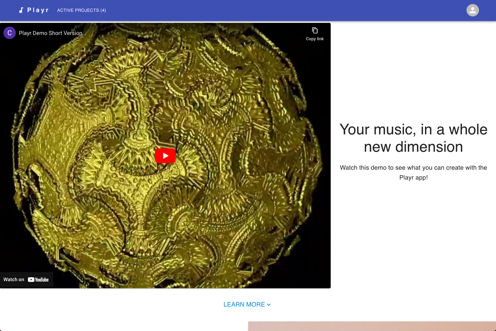
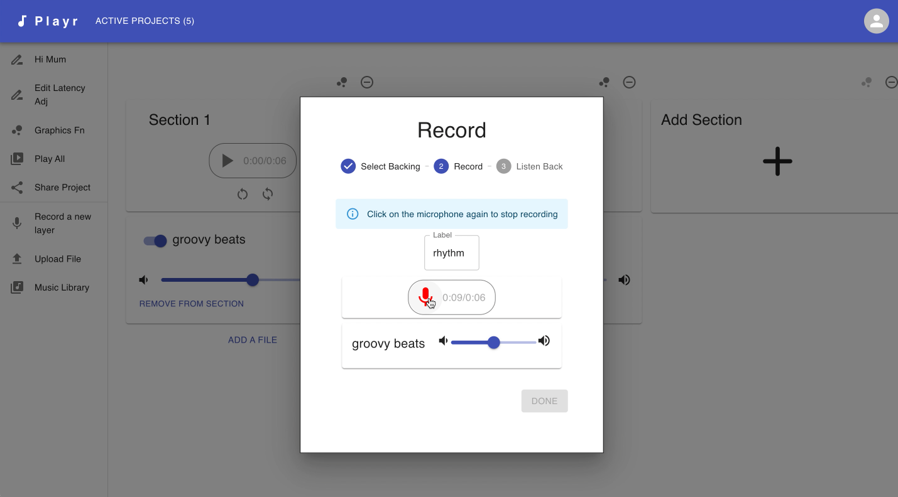
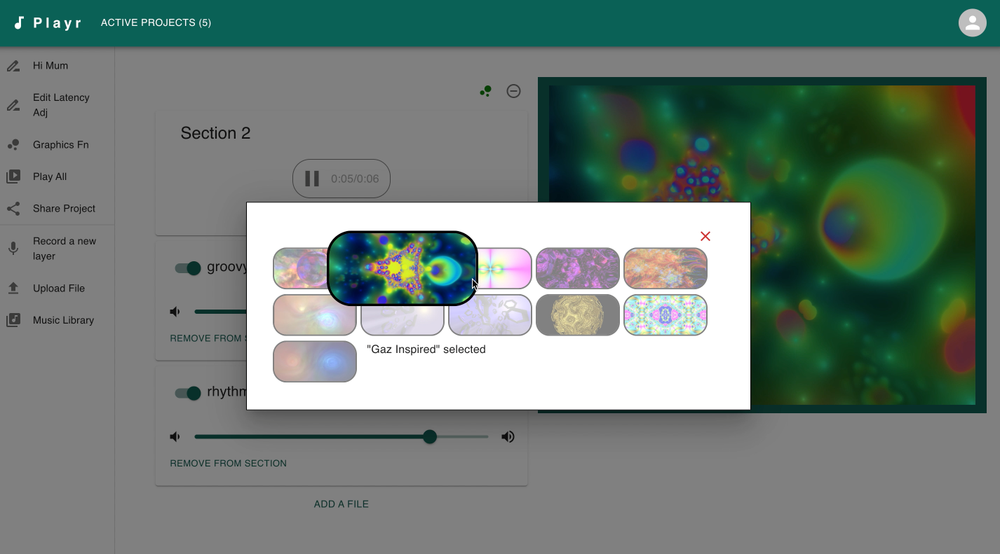
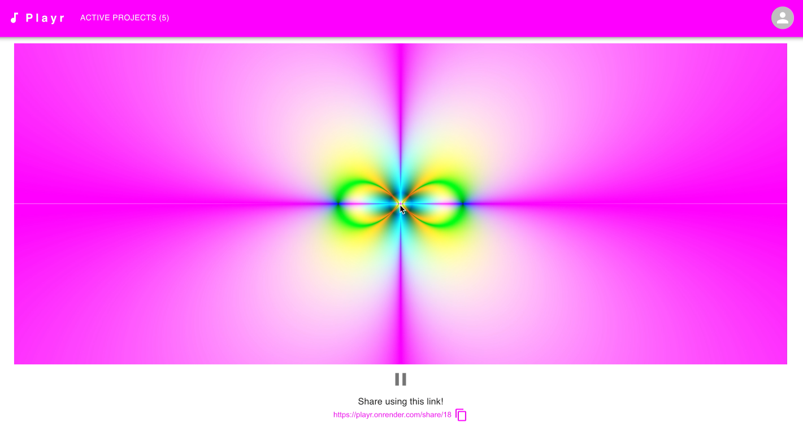

# audioAnimated

An interactive web application to create music with beautiful animations that move to your music and share them with your friends.



1. Watch our recorded demo to see what you can create: https://youtu.be/h_EGWJua-0w
2. Then Create an account
3. Record with our in-app recording software, or upload existing files into your project editor. Create music by layering and connecting tracks together.



4. Choose a base graphic for your project, and watch the animation move and breathe with your song.



5. Share with your friends by generating a sharable link.



## Setup

### Environment variables

A `.env` file is required to run this app in development.

1. Add a `.env` in the root dir of this repo
2. add these variables:

```
AUDIO_DATA_DIR="location-where-audio-files-are-saved-in-backend"
```

audio files that are uploaded or created in the app will be saved in this directory.

### Development

- install all required packages using `$ npm install`
- You will need to have postgreSQL installed in your local dev env.
- create the database `audioanimated`
- Seed the database by running `$ npm run seed`
- Run the app in dev by running : `$ npm run start`
